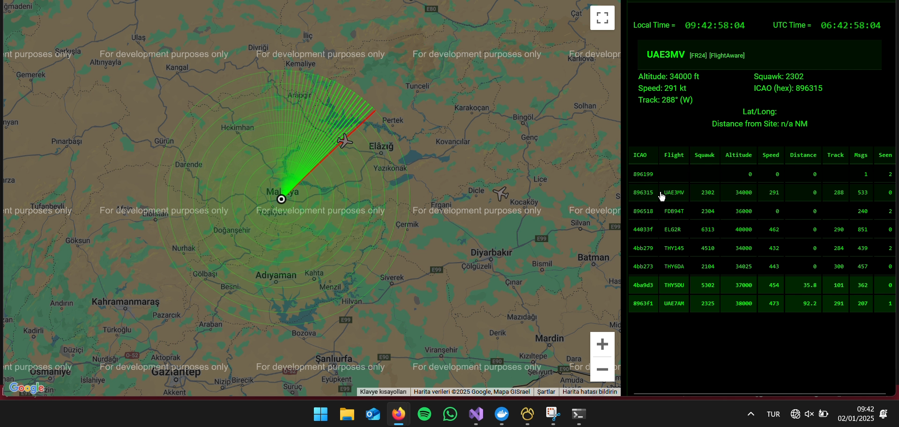
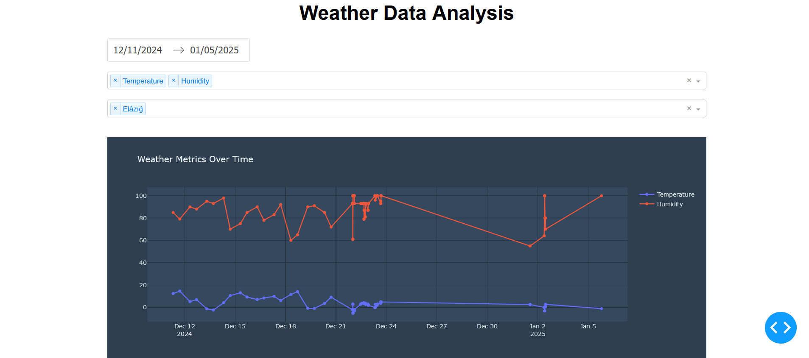

# UAV Tower (Unmanned Aerial Vehicle Tower)

**Developed by:**
- Ethem MERÇ (Scrum Master)
- Berkan BAĞIT
- Hivda KORKMAZ

## Features

The project is structured around four key components:

    RF technology
    PC technology
    Image processing
    Embedded systems

The project documentation can be accessed through the following link:
> https://github.com/mercethem/UAV_Tower/tree/main/Documents


- **Real-Time Data Visualization:**
  - Detects the positions of aircraft using ADS-B (Automatic Dependent Surveillance-Broadcast) data and presents this data as a real-time radar image on a map.The highest detected flight altitude in the current system is 41,000 feet, and the approximate straight-line distance is 122 km.
  - Can visualize in radar and thermal modes using satellite imagery.
  - Images are refreshed every two hours.
  
- **Database Integration:**  
  - Aircraft data can be stored in three different database management systems: PostgreSQL, MongoDB, and Redis.
  - Database backup operations are automatically performed each time the program is started and on the 1st of every month.
  
- **Weather Data:**  
  - In addition to aircraft data, the project can receive weather data, visualize it, and create graphs.

- **High Performance:**  
  - The system processes flight data quickly and effectively to provide real-time information to users.

## Requirements

- **Docker:** The databases run in Docker containers.
- **Veritabanları:** PostgreSQL, MongoDB, Redis (can be installed via Docker).
- **Dump1090 Calibration:** Dump1090 calibration needs to be performed to receive flight data.

## Installation

The project runs in an environment where the required databases are hosted on Docker. You can quickly set up and run the project by following these steps.

### 1. Clone the Project with Git Client :octocat:
 
```bash
cd C:\
```

```bash
git clone https://github.com/mercethem/UAV_Tower.git
```

### 2. Download Docker Images 🐋 

You can use the following commands to pull the necessary Docker images for the UAV Tower databases:

> https://hub.docker.com/r/ethemmerc/uav_tower/tags
    
```bash
docker pull ethemmerc/uav_tower:my-mongodb
```
    
```bash
docker pull ethemmerc/uav_tower:my-redis
```
    
```bash
docker pull ethemmerc/uav_tower:my-postgres
```


> ⚠️ Database Scripts are at the end of the readme.md ⚠️


### 3. Dump1090 Calibration 📡

To receive the data stream, Dump1090 needs to be properly calibrated. Run the following calibration command:

```bash
--interactive --net --net-ro-port 30002 --net-beast --mlat --gain 48.0 --quiet --ppm 53 --net-http-port 30003
```
Usage

After setting up the project, you can receive and visualize flight data. Flight data can be provided through port 30003.


### 4. Receiving Flight Data 🛫 
> ⚠️ Via radio frequencies without internet

Provide the flight data in the correct format.
Transmit the data through port 30003.
Once the data is received, it will be displayed instantly on the visualization screen.

-----------------------------------
You can view satellite images in radar and thermal modes in two different ways from the main screen. The images will refresh every two hours.

> Database Backup: The system automatically performs a database backup each time it is started and at 00:00 on the 1st of every month.

-----------------------------------

License

This project is licensed under the MIT License. For more details, please refer to the LICENSE file.

Acknowledgements

We would like to thank especially Salvatore Sanfilippo and the sat24 team, as well as all those who have supported the successful execution of this project. Their strong features and help have made significant contributions to our project.

------------------------------------------------------
### Radar Screen
  [](Documents/Screenshot_Login.png)

------------------------------------------------------
### Radar Screen
  [](Documents/Radar_Screenshot.png)

------------------------------------------------------

### Main Screen
[](https://github.com/user-attachments/assets/78c5dfce-aa89-42b4-9c0d-96336c49afc2)

------------------------------------------------------

### Weather Analysis Screen
  [](Documents/Weather_Analysis_Screenshot.png)

------------------------------------------------------


### Autonome Taxi
[](https://github.com/user-attachments/assets/c9af8737-2452-48da-8152-68f771a1665d)


[](https://github.com/user-attachments/assets/4927b85d-c33b-49da-9a52-4794242a12a0)

------------------------------------------------------

> 📚 DataBase Scripts

```bash
/*
 Source Server         : my-postgres
 Source Server Type    : PostgreSQL
 Source Server Version : 170000 (170000)
 Source Host           : localhost:5432
 Source Catalog        : Login
 Source Schema         : public

 Target Server Type    : PostgreSQL
 Target Server Version : 170000 (170000)
 File Encoding         : 65001
*/

-- ----------------------------
-- Table structure for users
-- ----------------------------
DROP TABLE IF EXISTS "public"."users";
CREATE TABLE "public"."users" (
  "id" varchar(64) COLLATE "pg_catalog"."default" NOT NULL,
  "username" varchar(50) COLLATE "pg_catalog"."default",
  "password" varchar(100) COLLATE "pg_catalog"."default"
)
;

-- ----------------------------
-- Records of users
-- ----------------------------
INSERT INTO "public"."users" VALUES ('bc50cf0eefb7028690eee659c1a553fb2d4b158488db10c53c9e395c210f9151', 'ADMIN', 'ADMIN');

-- ----------------------------
-- Primary Key structure for table users
-- ----------------------------
ALTER TABLE "public"."users" ADD CONSTRAINT "Login_pkey" PRIMARY KEY ("id");
```


```bash
/*
 Source Server         : my-postgres
 Source Server Type    : PostgreSQL
 Source Server Version : 170000 (170000)
 Source Host           : localhost:5432
 Source Catalog        : postgres
 Source Schema         : public

 Target Server Type    : PostgreSQL
 Target Server Version : 170000 (170000)
 File Encoding         : 65001
*/

-- ----------------------------
-- Sequence structure for flight_data_id_seq
-- ----------------------------
DROP SEQUENCE IF EXISTS "public"."flight_data_id_seq";
CREATE SEQUENCE "public"."flight_data_id_seq" 
INCREMENT 1
MINVALUE  1
MAXVALUE 2147483647
START 1
CACHE 1;

-- ----------------------------
-- Table structure for flights
-- ----------------------------
DROP TABLE IF EXISTS "public"."flights";
CREATE TABLE "public"."flights" (
  "id" int4 NOT NULL DEFAULT nextval('flight_data_id_seq'::regclass),
  "data" jsonb NOT NULL,
  "created_at" timestamptz(6) DEFAULT CURRENT_TIMESTAMP
)
;

-- ----------------------------
-- Alter sequences owned by
-- ----------------------------
ALTER SEQUENCE "public"."flight_data_id_seq"
OWNED BY "public"."flights"."id";
SELECT setval('"public"."flight_data_id_seq"', 10662, true);

-- ----------------------------
-- Primary Key structure for table flights
-- ----------------------------
ALTER TABLE "public"."flights" ADD CONSTRAINT "flight_data_pkey" PRIMARY KEY ("id");
```


```bash
/*
 Source Server         : my-postgres
 Source Server Type    : PostgreSQL
 Source Server Version : 170000 (170000)
 Source Host           : localhost:5432
 Source Catalog        : WeatherDataAnalysis
 Source Schema         : public

 Target Server Type    : PostgreSQL
 Target Server Version : 170000 (170000)
 File Encoding         : 65001
*/


-- ----------------------------
-- Sequence structure for weather_data_id_seq
-- ----------------------------
DROP SEQUENCE IF EXISTS "public"."weather_data_id_seq";
CREATE SEQUENCE "public"."weather_data_id_seq" 
INCREMENT 1
MINVALUE  1
MAXVALUE 2147483647
START 1
CACHE 1;

-- ----------------------------
-- Table structure for weather_data
-- ----------------------------
DROP TABLE IF EXISTS "public"."weather_data";
CREATE TABLE "public"."weather_data" (
  "id" int4 NOT NULL DEFAULT nextval('weather_data_id_seq'::regclass),
  "description" varchar(255) COLLATE "pg_catalog"."default",
  "temperature" float8,
  "feelslike" float8,
  "humidity" int4,
  "windspeed" float8,
  "pressure" int4,
  "clouds" int4,
  "visibility" int4,
  "weatherid" int4,
  "sunrise" timestamp(6),
  "sunset" timestamp(6),
  "lat" float8,
  "lon" float8,
  "city" varchar(255) COLLATE "pg_catalog"."default",
  "recorddatetime" timestamp(6)
)
;

-- ----------------------------
-- Alter sequences owned by
-- ----------------------------
ALTER SEQUENCE "public"."weather_data_id_seq"
OWNED BY "public"."weather_data"."id";
SELECT setval('"public"."weather_data_id_seq"', 228, true);

-- ----------------------------
-- Primary Key structure for table weather_data
-- ----------------------------
ALTER TABLE "public"."weather_data" ADD CONSTRAINT "weather_data_pkey" PRIMARY KEY ("id");
```


```bash
/*
 Source Server         : my-mongodb
 Source Server Type    : MongoDB
 Source Server Version : 80003 (8.0.3)
 Source Host           : localhost:27017
 Source Schema         : FlightDataDB

 Target Server Type    : MongoDB
 Target Server Version : 80003 (8.0.3)
 File Encoding         : 65001
*/


// ----------------------------
// Collection structure for Flights
// ----------------------------
db.getCollection("Flights").drop();
db.createCollection("Flights");
```


```bash
// Source Server         : my-redis
// Source Server Type    : Redis
// Source Server Version : 70401 (7.4.1)
// Source Host           : localhost:6379
// Source Schema         : 0

// Target Server Type    : Redis
// Target Server Version : 70401 (7.4.1)
// File Encoding         : 65001


// ----------------------------
// Records of Database 0 (All Data)
// ----------------------------
SET Flights:06a0b1 "{\r\n  \"Flight\": \"QTR8C\",\r\n  \"Hex_ICAO\": \"06a0b1\",\r\n  \"Squawk\": \"3266\",\r\n  \"Latitude\": 0,\r\n  \"Longitude\": 0,\r\n  \"Altitude\": 40000,\r\n  \"Speed\": 486,\r\n  \"VertRate\": 0,\r\n  \"Track\": 288,\r\n  \"ValidPosition\": 0,\r\n  \"ValidTrack\": 1,\r\n  \"Messages\": 37,\r\n  \"Seen\": 1,\r\n  \"LastUpdated\": \"2024-12-23T08:13:02Z\"\r\n}"
SET Flights:4baa8b "{\r\n  \"Flight\": \"THY70D\",\r\n  \"Hex_ICAO\": \"4baa8b\",\r\n  \"Squawk\": \"0716\",\r\n  \"Latitude\": 0,\r\n  \"Longitude\": 0,\r\n  \"Altitude\": 34025,\r\n  \"Speed\": 552,\r\n  \"VertRate\": -768,\r\n  \"Track\": 93,\r\n  \"ValidPosition\": 0,\r\n  
```


